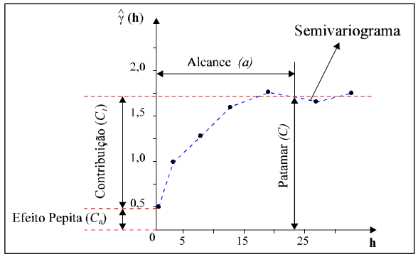

```{r, eval=FALSE, echo=FALSE}
rmarkdown::render('index.Rmd', encoding = 'UTF-8'")
```

# Introdução

A geoestatística como conhecemos hoje começou com os trabalhos de @Krige1951. Para ele somente a informação dada pela variância não seria suficiente para explicar o fenômeno em estudo. Para tal, seria necessário levar em consideração a distância entre as observações. A partir daí surge o conceito da `geoestatística`, que leva em consideração a `localização geográfica` e a `dependência espacial` entre amostras. 
@Matheron1963 e @Matheron1971 , baseado-se nas observações de Krige, desenvolveu a teoria das `variáveis regionalizadas`. Uma variável regionalizada é uma função numérica com distribuição espacial, que varia de um ponto a outro com continuidade aparente, mas cujas variações não podem ser representadas por uma função matemática simples.
A teoria das variáveis regionalizadas pressupõe que a variação de uma variável pode ser expressa pela soma de três componentes: a) uma componente estrutural, associada a um valor médio constante ou a uma tendência constante; b) uma componente aleatória, espacialmente correlacionada; e c) um ruído aleatório ou erro residual.
Assim um valor da variável Z em um local x é dado por:

$$ Z(x)=m(x)+\varepsilon′(x)+\varepsilon′′ $$
onde: m(**x**) é uma função determinística que descreve a componente estrutural de Z
em x; ε′(**x**) é um termo estocástico, que varia localmente e depende espacialmente de
m(**x**); ε′′ é um ruído aleatório não correlacionado, com distribuição normal com
média zero e variância σ2

Um dos modelos mais simplistas dessa variação é o calculado pelo `inverso do quadrado da distância` que assume que qualquer atributo do solo varia a taxa fixa do inverso da distância, o que na prática não é bem verdade, mas em muitos casos esse modelo atende a necessidade. 

## Variograma
O variograma é uma ferramenta básica de suporte às técnicas de krigagem, que permite representar quantitativamente a variação de um fenômeno regionalizado no espaço. Considere duas variáveis regionalizadas, X e Y, onde X = Z(x) e Y = Z(x+h). Neste caso, referem-se ao mesmo atributo medido em duas posições diferentes.

O nível de dependência entre essas duas variáveis regionalizadas, X e Y, é representado pelo variograma, 2γ(**h**), o qual é definido como a esperança matemática do quadrado da diferença entre os valores de pontos no espaço, separados pelo vetor distância **h**, isto é,

$$ 2γ(h) = E{[Z(x)-Z(x+h)] 2 } = Var[Z(x)-Z(x+h)]$$
Através de uma amostra z(x i ), i=1, 2, /home/elias/MEGA/Geo., n, o variograma pode ser estimado por

$$ 2Ŷ(h)=\frac{1}{N(h)}\sum^{N(h)}_{i=1}[Z(x_i)-Z(X_i+h)]²$$
onde:
- 2Ŷ(**h**) - é o variograma estimado;
- N(h) - é o número de pares de valores medidos, z(**xi**) e z(**xi+h**), separados por um vetor distância **h**;
- z(xi) e z(xi +h), - são valores da i-ésima observação da variável regionalizada, coletados nos pontos **xi** e **xi+h** (i = 1, /home/elias/MEGA/Geo., n), separados pelo vetor **h**.

## Parâmetros do semivariograma
O seu padrão representa o que, intuitivamente, se espera de dados de campo, isto é, que as diferenças {Z(**xi**) - Z(**xi+h**)} decresçam à medida que **h**, a distância que os separa decresce. É esperado que observações mais próximas geograficamente tenham um comportamento mais semelhante entre si do que aquelas separadas por maiores distâncias. Desta maneira, é esperado que γ(**h**) aumente com a distância **h**.

```{r variogram, echo=FALSE,message=FALSE, warning=FALSE, fig.cap= "Exemplo de Semivariograma.",fig.align='center', dpi=50, fig.asp=1}

```
- Alcance (a) (range): distância dentro da qual as amostras apresentam-se correlacionadas espacialmente. 
- Patamar (C) (sill): é o valor do semivariograma correspondente a seu alcance (a).Deste ponto em diante, considera-se que não existe mais dependência espacial entre as amostras, porque a variância da diferença entre pares de amostras (Var[Z(**x**) - Z(**x+h**)]) torna-se invariante com a distância. Pode ser definido também como variância total.
- Efeito Pepita (C0)(nugget): A medida que **h** tende para 0 (zero), g(**h**) se aproxima de um valor positivo chamado Efeito Pepita (C0), que revela a descontinuidade do semivariograma para distâncias menores do que a menor distância entre as amostras, pode ser definido também como variância residual. 

## Estrutura espacial local
Se consideramos as coordenadas de cada ponto é possível obervar uma tendência regional ou uma estrutura local dos dados, umas das formas mais simples de observar a dependência espacial é atraves de plot espacial dos valores observados.

Agora analisamos a ideia de dependência espacial local: “mais perto no espaço geográfico implica mais perto no espaço de atributos”. Isso pode ser verdade ou não;e se for verdade, o intervalo de dependência irá variar, dependendo do processo físico que produziu o atributo que está sendo investigado, nesse caso o teor de argila do solo.
O conceito fundamental é que deve ser entendido nesse contexto é a `autocorrelação espacial`: um valor de atributo pode ser correlacionado consigo mesmo, com a força da correlação dependendo da distância de separação (e possivelmente na direção). Isso deve ser evidente como uma relação entre a distância de separação e correlação; para análisar essas relações usamos o conceito de `semivariância` como já mencionado quando apresentado o semivariograma.Esse análise é feita com base no número de pares possíveis do dataset que pode ser determinado por (n × (n - 1))/2 pares.

Quando fazemos o variograma experimental dos teores de COT, é calculado as semivariâncias *médias* dos pares de pontos versus distância *média*(também conhecido como "lag"), com cumprimento definido pelo usuário, e distância máxima de busca *cutoff*. 


## Modelos teóricos
Selecionar uma forma de modelo é uma arte; a melhor maneira é a partir do conhecimento do processo espacial e da forma como o modelo se ajusta ao semivariograma esperimental. 
A função vgm especifica um modelo de variograma. No conjunto anterior nós estimamos esses parâmetros observando o variograma empírico, então os fornecemos como parâmetros do modelo. Observe que para cada modelo há um conjunto de parâmetro que melhor se ajusta. Para fins de exemplo vamos testar os 3 principais modelos, neles teremos que ajustar o "parcial sill" (contribuição) `psill` que é o patamar menos o efeito pepita (nugget) e o alcance (range)
Possíveis modelos no pacote `gstat`
```{r, include=T, warning=FALSE}
library(gstat)
library(sp)
library(readxl)
library(tmap)
library(raster)
print(show.vgms())
```

```{r, lendo e plotando os dados}
data <- read_excel("/home/elias/MEGA/Geo/data/Análises.xls", 
                       col_types = c("numeric", "numeric", "numeric", 
                                     "numeric", "numeric", "numeric", 
                                     "numeric", "numeric", "numeric", 
                                     "numeric"))

## Definindo o sistema de projeto do conjunto de dados
WGS23S  = sp::CRS("+proj=utm +zone=23 +south +datum=WGS84 +units=m +no_defs +ellps=WGS84 +towgs84=0,0,0")

## Transformando o dataframe "data" em informação espacial
coordinates(data) = ~X+Y
sp::proj4string(data) = WGS23S ## Definindo sistema de coordenadas para os DADOS

plot(data)

## Carregando arquivo raster para uso como grid de refer?ncia na interpolação
raster=raster::brick("/home/elias/MEGA/Geo/raster/mosaico.tif")
#plotRGB(raster, 1, 2, 3)
sp::proj4string(raster) = WGS23S 
#raster=projectRaster(raster, crs = WGS23S)
#plot(raster)
## Transformando o arquivo "raster" em arquivo "SpatialPixelsDataFrame" para posterior uso como grid de referência
grid=as(raster, "SpatialPixelsDataFrame")

############### Analisando de forma qualitativa a depedência espacial)
plot(data, asp=1, cex=4*data$ADT/max(data$ADT), pch=1)

#############
# Aqui vamos ver de forma detalhada e didática (passo a passo) da avaliação de depedência espacial. Na prática não há necessidade de seguir todos esses passos. 

n <- length(data$COT) # comprimento do conjunto de dados
n*(n-1)/2  ## Calculando o número de pares de pontos

# Agora como exercício vamos calcular a semivariância entre os dois primeiros pontos do dataset
coordinates(data)[1,] # linha 1
coordinates(data)[2,] # linha 2
sep <- dist(coordinates(data)[1:2,]) # distância entre o ponto 1 e ponto 2
gamma <- 0.5 * (data$ADT[1] - data$ADT[2])^2 # semivariância entre o ponto 1 e ponto 2

max(dist(data@coords))*2/3 # Máxima distância entre os pontos, para limitar a distância do variograma em 2/3 da Máxima distância
min(dist(data@coords)) # minima distância entre pontos, ajuda a definir o tamanho do lag

# Variograma de núvem
variograma <- gstat::variogram(COT ~ 1, data, cloud = TRUE, cutoff = Inf)
plot(variograma, ylab = "semivariância", xlab = "distância (m)")

# Variograma experimental
v <- variogram(COT ~ 1, data, cutoff=90, width=7)
print(plot(v, plot.numbers=F))
# width é o tamanho do lag (passo), ou seja, um ponto médio (uma simplificação) a cada 1800 m
# Cutoff = distância Máxima de busca que a gente viu em 2/3 é em torno de 70000 m, mas vimos que uma distância mais curta é melhor então usamos 11000


####### Alguns exemplos de possíveis modelos disponíveis em R #####
print(show.vgms())

### Modelo esférico
vm1 <- vgm(psill=15, model="Sph",range=40,nugget=0)
print(plot(v, pl=F, model=vm1, main = "Esférico"))


### Modelo Exponencial
vm2 <- vgm(psill=15, model="Exp",range=15,nugget=0)
print(plot(v, pl=F, model=vm2))


### Modelo Gaussiano
vm3 <- vgm(psill=16, model="Gau",range=20,nugget=0)
print(plot(v, pl=F, model=vm3))

# Modelo Ajustado esférico
(vmf1 <- fit.variogram(v, vm1))
print(plot(v, pl=F, model=vmf1))

# Modelo Ajustado Exponencial
(vmf2 <- fit.variogram(v, vm2))
print(plot(v, pl=F, model=vmf2))

# Modelo Gaussiano
(vmf3 <- fit.variogram(v, vm3))
print(plot(v, pl=F, model=vmf3))
```
# krigagem
Agora usamos a estrutura espacial para interpolar "de forma otimizada" para os locais não amostrados. Existem muitas maneiras de interpolar; vamos primeiro investigar a krigagem ordinária.
O que há de tão especial na krigagem?
• Prevê em qualquer ponto como a média ponderada dos valores em pontos não amostrados
• Os pesos dados a cada ponto da amostra são ótimos, dado a estrutura de covariância, conforme revelado pelo modelo de variograma (neste sentido o que é “melhor” se ajutou)
• A variação de krigagem em cada ponto é gerada automaticamente como parte do processo de cálculo dos pesos.

## Krigagem ordinária
Antes de fazer as predições nos grids para geração dos mapas vamos fazer as predições no conjunto de dados de validação para avaliar o desempenho dos modelos. 

```{r, kriging}
### Krigando no grid para geração do mapa
## Carregando o limite da área no formato shapefile
limite <- maptools::readShapeSpatial("/home/elias/MEGA/Geo/shape/limite.shp", 
                                     proj4string=WGS23S, verbose=TRUE)
### Predicão Exp
grid <- krige(COT ~ 1, locations=data, newdata=grid, model=vm3)
grid <- raster::stack(grid)
grid = raster::mask(grid, limite)
raster = raster::mask(raster, limite)

tm_shape(limite)+
  tm_polygons(col = "lightgrey")+
  tm_shape(data) +
  tm_symbols(col = "COT", palette = 'YlOrRd', size = "COT", scale = 1.5,
             legend.size.show = F,    # comment this line to see the original size legend
             legend.col.show = T,     # comment this line to see the original color legend
             title.col="AWC (mm)") +
  tm_compass(position = c("center", "top"), size=4) +
  tm_grid(alpha = 0.2, labels.size = 1, labels.rot = c(0,90), n.x=5, n.y=6) + 
  tm_scale_bar(position = c("right", "bottom"), text.size =1) +
  tm_layout(title = "", legend.position = c("left", "top"), main.title.position = 'center', legend.text.size = 1)


tm_shape(grid$var1.pred) +
  tm_raster(title = "COT (g.kg-1)", style = "cont",  breaks = c(0,5,10,15,20,25))+
  tm_shape(limite)+
  tm_polygons(col = "black", alpha = 0, border.col="black")+
  tm_compass(position = c("right", "top"), size=4) +
  tm_grid(alpha = 0.2, labels.size = 1, labels.rot = c(0,90), n.x=3, n.y=3) + 
  tm_scale_bar(position = c("right", "bottom"), text.size =1) +
  tm_layout(title = "", legend.position = c("left", "top"), main.title.position = 'center', legend.text.size = 1)


tm_shape(raster) +
  tm_rgb(r=1, g=2, b=3)+
  tm_shape(limite)+
  tm_polygons(col = "black", alpha = 0, border.col="black")+
  tm_compass(position = c("right", "top"), size=4) +
  tm_grid(alpha = 0.2, labels.size = 1, labels.rot = c(0,90), n.x=3, n.y=3) + 
  tm_scale_bar(position = c("right", "bottom"), text.size =1) +
  tm_layout(title = "", legend.position = c("left", "top"), main.title.position = 'center', legend.text.size = 1)
```

### Se você chegou até aqui muito bem !!!! 👏👏👏

# Referências