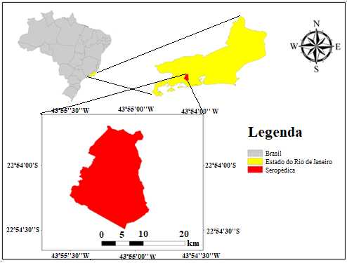

```{r, eval=FALSE, echo=FALSE}
rmarkdown::render('index.Rmd', encoding = 'UTF-8'")
```

# Introdução
## Conceitos básicos e terminologias
A *amostragem* diz respeito à seleção de um subconjunto de indivíduos de uma população para estimar características de toda a população [@Wang2012a]. Ou a amostragem pode ser definida como seleção de partes de um universo finito, com a proposta de obter informações desse universo [@deGruijter2006]. A *amostra* pode ser definida como a parte coletada, e levada para laboratório, ou observada *in situ*.  E uma única parte dessa amostra pode ser  definida como *unidade amostral*, o número de unidades amostrais é definido como *tamanho amostral* ou *n amostral* [@deGruijter2006]. 
Uma confusão comum na literatura é sobre a definição de amostragem aleatória e amostragem arbitrária ou casual [@Brus2019] no segundo caso os locais de amostragem são escolhidos, fundamentalmente, em função da subjetividade da pessoa conduzindo o trabalho. Para evitar a confusão o termo *amostragem probabilística* deve ser priorizado para as amostras aleatórias. A amostragem de probabilística é uma amostragem aleatória que atende a dois requisitos. Em primeiro lugar, todas as unidades da população têm uma probabilidade positiva de serem selecionadas. Nenhuma parte da população pode ser excluída. Em segundo lugar, a probabilidade de seleção de cada amostra possível é conhecida. Com amostragem arbitrária (casual), esses dois requisitos geralmente não são atendidos [@Brus2019].


## Amostragem no mapeamento convencional de solos
No caso do mapeamento convencional de solos, o método de prospeção e a frequência de amostragem dependem do nível de detalhe e do objetivo do levantamento [@IBGE2015]. Por exemplo, na terceira edição do Manual Técnico de Pedologia [@IBGE2015] o método de prospeção indicado para levantamento exploratório é o de extrapolação, generalizações, correlações e poucas observações de campo, com uma frequência de amostragem de um perfil completo por classe de solo predominante na associação. Para o levantamento semi-detalhado a densidade de observações e a frequência de amostragem são calculadas em função da heterogeneidade da área e da facilidade de correlação de solos e a superfície geomorfológicas. No entanto, é recomendada uma média de 0,002 a 0,20 observações por hectare e um perfil completo e um complementar por classe de solo componente da unidade de mapeamento simples ou associação. 
Porém para o mapeamento digital de solos (MDS) esse esquema de amostragem não se aplica, pois não fornece estimativa estatística representativa. No MDS é necessário o uso de estratégias de amostragem estatisticamente robustas para diminuir a subjetividade e consequentemente os possíveis erros na predição [@Minasny2007b]

## Amostragem no mapeamento digital de solos(MDS)
No caso do MDS a amostragem é um fator crucial, pois pode contribuir para elevar ou diminuir os custos do levantamento de solos. E é considera uma das etapas mais importantes para o MDS [@CarvalhoJunior2014]. Normalmente no MDS, as amostras de calibração de modelos (geo)estatísticos as amostras coletadas devem representar ao máximo a distribuição espacial do que está sendo modelado (atributo ou classe de solo), por isso técnicas como o Hipercubo Latino Condicionado (cLHS) [@Minasny2006] são frequentemente usados nessa etapa e para essa finalidade. Esse tipo de amostragem é conhecido como amostragem não probabilística e será abordado com mais detalhes nos exemplos. 
Para validação dos resultados das predições espaciais no MDS o tipo de abordagem recomendado é a amostragem probabilística [@BrusEtAl2011], esse tipo de amostragem busca a imparcialidade e diminuição de viés para validação dos produtos do mapeamento.  Atenção especial deve ser tomada nessa etapa, pois nem sempre é possível uma amostragem completamente probabilística (aleatória). Há então a necessidade de encontrar a condição perfeita do que é factível e o ideal. Exemplos de amostragem probabilística serão abordados com mais detalhe nos exemplos.  
Parte do material aqui desenvolvido foi extraído e adaptado do livro em desenvolvimento de Alessandro Samuel-Rosa, [pedometria feita simples](http://samuel-rosa.github.io/pedometria-feita-simples/principios-da-amostragem-espacial.html). O capítulo 7 do livro trata de princípios da amostragem espacial. Também foram extraídas informações a respeito de amostragem para validação de mapas digitais de solos [@BrusEtAl2011] e amostragem para mapeamento de solos [@Brus2019]. Assim objetivo desse tutorial e compilar as informações dos trabalhos mencionados para simular diferentes estratégias amostrais e dar suporte aos levantamentos de solos com foco em MDS e na agricultura de precisão (AP) e avaliação dos produtos gerados. 


# Área experimental e base dados
## Área experimental
Ao longo desse tutorial sobre amostragem, você verá exemplos de cada tipo de amostragem implementados no R usando o conjunto de dados de um área experimental localizada no município de Seropédica, estado do Rio de Janeiro, Brasil, nas coordenadas geográficas centrais aproximadas 22º54’00” S e  43º55’00” W (Figura \@ref(fig:localizacao1)). 
```{r localizacao1, echo=FALSE,message=FALSE, warning=FALSE, fig.cap= "Mapa de localização do município de Seropédica-RJ. Fonte: Nascimento (2019)",fig.align='center', dpi=80, fig.asp=1}

```

Especificamente, o trabalho foi desenvolvido na Fazendinha Agroecológica km 47 (Sistema Integrado de Produção Agroecológica - SIPA), associada à Embrapa Agrobiologia, Empresa de Pesquisa Agropecuária do Estado do Rio de Janeiro (Pesagro-Rio) e Universidade Federal Rural do Rio de Janeiro, nas coordenadas geográficas centrais aproximadas 22º45’0” S e 43º40’30” W (Figura \@ref(fig:localizacao2)). 
```{r localizacao2, echo=FALSE,message=FALSE, warning=FALSE, fig.cap= "Mapa de localização da área de estudo em Seropédica-RJ. Fonte: Nascimento (2019)",fig.align='center', dpi=120, fig.asp=1}
knitr::include_graphics("localizacao2.png")
```

O clima do município caracteriza-se por ser do tipo Aw (Tropical com inverno seco), segundo a classificação de Köppen. Seropédica tem uma temperatura média de 23,5 °C e uma pluviosidade média anual de 1354 mm. Os maiores valores de precipitação são verificados nos meses de novembro a janeiro e os menores no período entre maio e agosto [@Oliveira-J2014]. A área dos exemplos encontra-se ocupada por pastagem e caracteriza-se por apresentar relevo suave-ondulado a ondulado, altitude entre 17 a 50 m sobre o nível do mar, e ausência de rochosidade e pedregosidade em superfície [@Nascimento2019].

Os solos da área experimental são caraterizados por apresentar, no geral, baixa fertilidade e elevado grau de desenvolvimento com fatores e processos de formação específicos e dominantes para cada ordem e posição da paisagem. Para o trabalho de onde os dados derivam [@Nascimento2019], foram abertas 10 trincheiras em diferentes pontos da paisagem, onde foram descritos, coletados e classificados perfis de solo, sendo uma trincheira no topo (P10), duas na posição de terço médio (P3 e P9), uma no terço inferior (P8), três no sopé da vertente (P2, P5 e P7) e três na área de baixada (P1, P4 e P6). Os solos foram classificados respectivamente como Argissolos Vermelhos P10, P9 e P3; Argissolo Amarelo, P8; Planossolos Háplicos (arênicos e espessarenicos), P7,P2,P5; Planossolos Háplicos (gleissólicos), P4, P6 e Cambissolo Hálico (com evidente processos de gleização) P1 (Figura \@ref(fig:localizacao2)). 

## Base de dados (Covariáveis ambientais)
As covariáveis ambientais para modelar as propriedades do solo foram derivadas de duas fontes de dados: modelo digital de elevação, dados de sensoriamento remoto (imagem orbital-RadipEye). Essas foram escolhidas para descrever os principais fatores de formação do solo, de acordo com a abordagem *scorpan* [@McBratneyEtAl2003].

*Modelo Digital de Elevação (MDE)*: O MDE utilizado, com resolução espacial de 2 m, foi gerado a partir das curvas de nível e pontos cotados coletados com gps geodésico. Do MDE foram derivados 12 atributos de terreno com potencial de uso para modelagem no MDS. 

*Imagem de satélite*: foram utilizadas duas cenas do sensor RapidEye ambas de 2011. As duas cenas foram usadas para cobrir toda a área de estudo, essas imagens têm resolução radiométrica de 12 bits, resolução espacial de 6,5 m, que ortorretificadas têm 5m [@RapidEye2012].
Das cenas foram derivados os índices de vegetação (NDVI, inglês) e índice de vegetação ajustado ao solo (SAVI, inglês).

## Áreas ambientalmente homogêneas (Estratos)
Para fazer o exercício foram criadas áreas ambientalmente similares (homogêneas), essa abordagem é indicada em casos onde há por exemplo o interesse de fazer a amostragem por estratos. Nesse exercício optou-se por criar 10 estratos usando as variáveis, que julgamos serem as mais representativas para discretizar os ambientes. Foram elas elevação, declividade e SAVI. Para fazer o agrupamento da áreas de maior similaridade (criação de clusters) foi utilizado o algorítimo de classificação não supervisionada *K-Means Clustering* que visa particionar os pontos em k grupos de forma que a soma dos quadrados dos pontos aos centros de cluster designados seja minimizada. No mínimo, todos os centros do cluster estão na média dos seus conjuntos de Voronoi (o conjunto de pontos de dados que estão mais próximos do centro do cluster).

## Você pode baixar os dados usados aqui no seguinte link
Para baixar shapes [shape](https://mega.nz/folder/2FYmnSTZ#U8KUUKsOV5DzaBK5oQXEzA) e para baixar os dados [data](https://mega.nz/folder/PMIi1IzT#OqptGkjIKxJigwPFGPB47g)

```{r, warning=FALSE, message=FALSE}
## Carregar os pacotes
library(sp)
library(raster)
library(sampling)
library(maptools)
library(rgdal)
library(clhs)
library(spsann)
library(sf)
# Carregando a base de dados da fazendinha
# Aqui você precisa direcionar o diretório onde salvou os dados no seu computador
dados <- read.csv("/home/elias/MEGA/Fazendinha/data/dataset.csv"); dados=dados[2:54]
grid <- read.csv("/home/elias/MEGA/Fazendinha/data/grid.csv"); grid=grid[2:23]

# criando um cluster de unidades homogêneas usando os dados das covariáveis ambientais
cluster <- kmeans(grid[, c(1,2,20)], 10)
cluster = data.frame(cluster$cluster)
grid=cbind(grid,cluster)

## Foi necessário transformar os estratos para fator 
##porque estava dando erro quando calculava o número
## de amostras por estrato 

# Função para transformar uma variável em fator
grid$cluster.cluster=as.factor(grid$cluster.cluster) 
grid1=grid
#cluster=data.frame(grid[,c("X","Y")],results=cluster$cluster)
#coordinates(cluster)= ~ X+Y; gridded(cluster)=T; cluster=raster(cluster)
#plot(cluster)

# Transformar o dataframe do grid em spatialdataframe
sp::gridded(grid) <- ~ X + Y
sp::proj4string(grid) <- sp::CRS("+proj=utm +zone=23 +south +ellps=GRS80 +
                                 towgs84=0,0,0,0,0,0,0 +units=m +no_defs") 

# Definindo o sistema de projção
crsSIRGAS2000=CRS("+proj=utm +zone=23 +south +ellps=GRS80 +
                  towgs84=0,0,0,0,0,0,0 +units=m +no_defs") 

#carregando arquivos shapfile
# Aqui você precisa direcionar o diretório onde salvou os dados no seu computador
## Estradas
estrada <- maptools::readShapeSpatial("/home/elias/MEGA/Fazendinha/shape/estrada.shp", 
                                         proj4string=crsSIRGAS2000,verbose=TRUE)
## Perfis completos
perfis <- maptools::readShapeSpatial("/home/elias/MEGA/Fazendinha/shape/pontos.shp", 
                                      proj4string=crsSIRGAS2000,verbose=TRUE)
```

# Amostragem para mapeamento de solos
Não existe um único tipo de estratégia amostral para qualquer trabalho de MDS ou AP, cada caso precisa ser estudado de forma particular e no geral a melhor estratégia depende do objetivo do projeto, do recurso financeiro e humano disponível e dificuldades operacionais encontradas na área que está sendo estuda. Do ponto de vista de dificuldades operacionais tem-se alguns variantes como limitação de acesso, por se tratar de áreas com acesso limitado, nesses casos há abordagens de amostragem específica como mostra @CambuleEtAl2013 onde se tem áreas de maior acessibilidade e que sejam representativas da área total de estudo. Ainda pode haver limitação por permissão de acesso, sobretudo em áreas particulares. Quanto aos tipos de amostragem elas são divididas basicamente em dois grupos ou tipos fundamentais: *Amostragem probabilística* e *não probabilística*

## Amostragem não probabilística
A amostragem não probabilística é uma técnica de amostragem em que as amostras são reunidas em um processo que não dá a todos os indivíduos, no caso de solos perfil de solo *pedon* ou ponto amostral da população, chances iguais de serem selecionados. A escolha dos locais de amostragem depende da definição de um critério a ser atendido, normalmente em MDS a caracterização da máxima variação de solos e suas propriedades representadas pelas covariáveis ambientais que simulam os fatores de formação do solo [@McBratneyEtAl2003].
A amostragem não-probabilística costuma ser dividida em três categorias:

*casual,
*conveniente, e
*intencional

Além disso há amostragens não probabilísticas, onde através de algoritmos e de acordo com uma determinada finalidade, pode ser feita a otimização da configuração amostral. As principias otimizações são para representar o máximo possível o espaço de atributos (ex: tipos e/ou propriedades do solo) e espaço geográfico. 

### Amostragem casual
Na amostragem casual os locais de amostragem são escolhidos, fundamentalmente, em função da subjetividade da pessoa conduzindo a amostragem. Não existe um critério claro a ser atendido. Outros locais amostrais podem ser escolhidos caso outra pessoa conduza a amostragem, mesmo que não haja justificativa plausível para isso. Para fim de MDS e aplicaçõs de AP esse tipo de amostragem não é recomendado e é mais comum em trabalhos de convencionais de análise de fertilidade do solo. 
Na prática, a amostragem casual consiste em transitar pela área a ser amostrada e, aqui e acolá (ex: Zig-Zag), definir um local para amostragem. No caso da amostra para fins de avaliação da fertilidade do solo normalmente é feito uma divisão da área em glebas (áreas menores, mais homogêneas). Essa divisão deve considerar a inclinação do terreno, o tipo de cultura, a idade da cultura, as adubações feitas anteriormente e etc. Esse tipo de amostragem dá a impressão de que as observações são aleatórias, um pressuposto estatístico comum, mas como elas foram escolhidas subjetivamente pela pessoa que está conduzindo o trabalho não é possível se calcular a probabilidade de inclusão de cada amostra, portanto ela é casual, mas não aleatória. 

```{r, warning=FALSE, message=FALSE}
main <- "Amostra casual (zig-zag)"
plot(
  grid@coords, type = "n", asp = 1, main = main,
  xlab = "Longitude (m)", ylab = "Latitude (m)")
image(
  grid, "cluster.cluster", col = terrain.colors(10), axes = TRUE, add = TRUE)
legend(
  "topleft", title = "Áreas homogêneas", fill = terrain.colors(3),
  legend = c("1", "2", "3", "4", "5", "6", "7", "8", "9", "10"),
  border = terrain.colors(10), bty = "n")
set.seed(2000)
pts <- sp::spsample(grid, n = 30, type = "nonaligned")
points(pts, pch = 21, cex = 0.75)
arrows(
  grid@coords[1, 1], grid@coords[1, 2], pts@coords[length(pts), 1],
  pts@coords[length(pts), 2],  length = 0.1)
for (i in 2:length(pts) - 1) {
  arrows(
    x1 = pts@coords[i, 1], y1 = pts@coords[i, 2], x0 = pts@coords[i + 1, 1], 
    y0 = pts@coords[i + 1, 2],  length = 0.1)
}
leg <- paste("Amostras (n = ", length(pts), ")", sep = "")
legend(635700, 7483400, legend = leg, pch = 21, bty = "n")

```

### Amostragem conveniente

Esse é um dos exemplos de amostragem em que o processo não é completamente aleatório, pois são priorizados por exemplo locais ao longo das estradas, num tipo de amostragem que pode ser aleatório (dentro do limite de acessibilidade, que seja conveniente) ou amostragem arbitrária, ou seja, amostragem sem uma finalidade específica em mente, a amostragem pode ser ainda direcionada em que o usuário decide os locais que serão amostrados. 
Esse tipo de amostragem busca otimizar recursos (financeiros e operacionais) evitando locais de difícil acesso, podendo assim realizar um número maior de observações. Como resultado esse tipo de amostragem tem observações concentradas por exemplo em áreas próximo a estradas e/ou trilhas, em áreas não montanhosas, em bordas, quando em condição de densas florestas. 
Aqui foram selecionadas amostras com distância máxima da estrada de 50 m

```{r, warning=FALSE, message=FALSE}
main <- "Amostra conveninte (distante da margem da estrada)"
plot(
  grid@coords, type = "n", asp = 1, main = main,
  xlab = "Longitude (m)", ylab = "Latitude (m)")
image(
  grid, "cluster.cluster", col = terrain.colors(10), axes = TRUE, add = TRUE)
legend(
  "topleft", title = "Tipo de solo", fill = terrain.colors(10),
  legend = c("1", "2", "3", "4", "5", "6", "7", "8", "9", "10"),
  border = terrain.colors(10), bty = "n")
plot(estrada, add=TRUE)
t=buffer(estrada, width=50)
r <- raster(grid) 
lr <- mask(r, t)
lr=as(lr, "SpatialPixelsDataFrame")
points(spsample(lr, n = 30, "random"), pch = 21, cex = 0.75)
leg <- paste("Amostras (n = ", length(pts), ")", sep = "")
legend(635700, 7483400, legend = leg, pch = 21, bty = "n")
```


### Amostragem intencional
Semelhante a amostragem convencional a amostragem intencional também busca otimizar recursos financeiros e operacionais, mas difere principalmente porque na amostragem intencional são agregados algum tipo de critério, por exemplo o pedológico, ou algum que atenda uma demnada específica em levantamento para fins de fertilidade do solo e/ou algum critério estatístico. 
Em geral, a amostragem intencional é o tipo de amostragem mais eficiente para a obtenção de observações de calibração para a modelagem espacial do solo. Isso se dá exatamente porque a localização das observações é definida com base no modelo usado para descrever a estrutura da variação espacial do solo bem como capturar as variações dos fatores envolvidos com gênese do solo [@McBratneyEtAl2003]. Em outras palavras, a configuração espacial das observações é otimizada para atender aos pressupostos e requerimentos do modelo formação do solo (*SCORPAN*) que será usado na modelagem. Quanto melhor as amostras representarem as relações solo-paisagem e estrutura espacial dos dados, melhor será o desempenho do modelo calibrado. 

#### Amostragem intencional sistemática
Na amostragem intencional sistemática usa algum critério pedológico e/ou estatístico e tem origem no modelo usado para descrever a estrutura da variação espacial do solo ou no método usado para fazer predições espaciais. Por exemplo, o objetivo pode ser selecionar os locais amostrais de maneira a obter a melhor cobertura espacial porque isso pode minimizar a incerteza ou erros das predições. O resultado dessa amostragem é a alocação de observações equidistantes no que é denominado *malha* ou *grid*, que pode ser quadrada ou triangular. 
Esse tipo de amostragem é comumente usado em trabalhos de mapeamento do solo para fins de AP, por exemplo para avaliação da fertilidade do solo, pois essas áreas são normalmente homogêneas e de mais fácil acesso. 

```{r, warning=FALSE, message=FALSE}
main <- "Amostra sistemática (malha quadrada)"
plot(
  grid@coords, type = "n", asp = 1, main = main,
  xlab = "Longitude (m)", ylab = "Latitude (m)")
image(
  grid, "cluster.cluster", col = terrain.colors(10), axes = TRUE, add = TRUE)
legend(
  "topleft", title = "Áreas homogêneas", fill = terrain.colors(10),
  legend = c("1", "2", "3", "4", "5", "6", "7", "8", "9", "10"),
  border = terrain.colors(10), bty = "n")
pts <- sp::spsample(grid, n = 30, type = "regular", offset = c(0.5, 0.5))
points(pts, pch = 21, cex = 0.75)
polygon(pts@coords[c(1, 2, 6, 5, 1), ])
leg <- paste("Amostras (n = ", length(pts), ")", sep = "")
legend(635700, 7483400, legend = leg, pch = 21, bty = "n")

main <- "Amostra sistemática (malha triangular)"
plot(
  grid@coords, type = "n", asp = 1, main = main,
  xlab = "Longitude (m)", ylab = "Latitude (m)")
image(
  grid, "cluster.cluster", col = terrain.colors(10), axes = TRUE, add = TRUE)
legend(
  "topleft", title = "Áreas homogêneas", fill = terrain.colors(10),
  legend = c("1", "2", "3", "4", "5", "6", "7", "8", "9", "10"),
  border = terrain.colors(10), bty = "n")
pts <- sp::spsample(grid, n = 34, type = "hexagonal", offset = c(0.5, 0.5))
points(pts, pch = 21, cex = 0.75)
polygon(pts@coords[c(1, 2, 5, 1), ])
leg <- paste("Amostras (n = ", length(pts), ")", sep = "")
legend(635700, 7483400, legend = leg, pch = 21, bty = "n")
```

#### Amostragem intencional caminhamento livre
No critério intencional denominado caminhamento livre, as amostras são escolhidas a fim de agregar as questões de custos, conhecimento do especialista (ex: Pedólogo), e máxima caracterização da área. A localização das observações é definida com base no conhecimento tácito do responsável, no seu modelo mental das relações solo-paisagem ou na pedogênese. O modelo mental é construído com a experiência obtida no campo e sua qualidade geralmente é diretamente proporcional ao número de anos de trabalho de campo e a diversidade de solos e paisagem que o profissional pode visitar. 
Alguns dos exemplos são amostragens em *Topossequência*, que busca amostrar os diferentes tipos de solos de acordo com sua variação topográfica, *Topolitossequência*, que é a variação no relevo e material de origem, *Climosequência*, que caracteriza variação nas condições climáticas da região de estudo. 

```{r, warning=FALSE, warning=FALSE, message=FALSE}
main <- "Caminhamento livre"
plot(
  grid@coords, type = "n", asp = 1, main = main,
  xlab = "Longitude (m)", ylab = "Latitude (m)")
image(
  grid, "cluster.cluster", col = terrain.colors(10), axes = TRUE, add = TRUE)
legend(
  "topleft", title = "Áreas homogêneas", fill = terrain.colors(3),
  legend = c("1", "2", "3", "4", "5", "6", "7", "8", "9", "10"),
  border = terrain.colors(10), bty = "n")
points(perfis, pch = 21, cex = 0.75)
text(perfis, perfis$id, cex=0.75, adj = c(01.5))
arrows(
  grid@coords[1, 1], grid@coords[1, 2], perfis@coords[length(perfis), 1], 
  perfis@coords[length(perfis), 2],
  length = 0.1)
for (i in 2:length(perfis) - 1) {
  arrows(
    x1 = perfis@coords[i, 1], y1 = perfis@coords[i, 2], x0 = perfis@coords[i + 1, 1], 
    y0 = perfis@coords[i + 1, 2], length = 0.1)
}
leg <- paste("Amostras n = 10", sep = "")
legend(635700, 7483400, legend = leg, pch = 21, bty = "n")
```

### Otimização de Configurações Amostrais

#### Hipercubo Latino Condicionado (cLHS)
O cLHS é um algoritmo de busca baseado em regras heurísticas combinadas com um cronograma de recozimento simulado. Para amostragem de uma área informações prévias representativas da área de estudo são fornecidas ao algoritmo como dados auxiliares (covariáveis ambientais). Ele fornece uma cobertura completa da faixa de cada covariável estratificando a distribuição marginal, ou seja, usa as informações fornecidas para produzir uma estratificação de amostragem otimizada [@Minasny2006]. Variações do cLHS para otimização de locais de amostragem podem ser encontradas em @Roudier2012, @Mulder2013, @CarvalhoJunior2014, @Clifford2014, @Kidd2014, e @Stumpf2016.
No caso desse exemplo foi usado como variáveis auxiliares no cLHS a elevação, declividade e SAVI, ou seja, as mesmas que foram escolhidas para gerar as áreas ambientalmente homogêneas (os estratos) que foram tidas como as principais nesse estudo de caso. 

```{r, warning=FALSE, message=FALSE}
dem=raster(grid[1])
slope=raster(grid[2])
savi=raster(grid[20])
stack=raster::addLayer(dem, slope, savi)
s <- rasterToPoints(stack, spatial=TRUE)
set.seed(2001)
pts <- clhs(s, size = 30, iter = 1000, progress = FALSE) 
main <- "Amostra pelo Hipercubo Latino Condicionado (cLHS)"
plot(
  grid@coords, type = "n", asp = 1, main = main,
  xlab = "Longitude (m)", ylab = "Latitude (m)")
image(
  grid, "cluster.cluster", col = terrain.colors(10), axes = TRUE, add = TRUE)
points(pts, pch = 21, cex = 0.75)
leg <- paste("Amostras (n = ", length(pts), ")", sep = "")
legend(635700, 7483400, legend = leg, pch = 21, bty = "n")
```

#### Identificação de tendência espacial e estimativa (optimCLHS) 
Essa é uma otimização de configurações de amostra para identificação de tendência espacial. As funções de otimização foram implementadas no pacote *spsann* do *R*.
Esse método busca otimizar uma configuração de amostra para identificação e estimativa de tendência espacial usando o método proposta por @Minasny2006, método anteriormente citado, conhecido como cLHS. Nesse método otimizado, uma função de utilidade *U* é definida para que a amostra reproduza a distribuição marginal e a matriz de correlação das covariáveis numéricas e as proporções de classe do fator covariáveis (cLHS). A função de utilidade é obtida agregando três funções objetivas: *O1*, *O2* e *O3*. Nesse exemplo assim com no cLHS usamos como variáveis auxiliares (covariáveis) a elevação, declividade e SAVI. 

```{r, warning=FALSE, message=FALSE, echo = T, results = "hide"}

candi <- grid1[, 21:22]; names(candi)[1] <- "x" ;names(candi)[2] <- "y"
covars <- grid1[, c(1,2,20)]
schedule <- scheduleSPSANN(
  chains = 1, initial.temperature = 0.001, x.max = 	635865.8, y.max = 7483684,
  x.min = 0, y.min = 0, cellsize = 40)
set.seed(2001)
pts <- spsann::optimCLHS(
  points = 30, candi = candi, covars = covars, use.coords = TRUE,
  clhs.version = "update",  weights = list(O1 = 0.5, O3 = 0.5), schedule = schedule)
main <- "Identificação de tendência espacial e estimativa (optimCLHS)"
plot(
  grid@coords, type = "n", asp = 1, main = main,
  xlab = "Longitude (m)", ylab = "Latitude (m)")
image(
  grid, "cluster.cluster", col = terrain.colors(10), axes = TRUE, add = TRUE)
points(pts$points[, 2:3], pch = 21, cex = 0.75)
leg <- paste("Amostras (n = ", length(pts), ")", sep = "")
legend(635700, 7483400, legend = leg, pch = 21, bty = "n")
```

#### Otimização de configurações de amostra para interpolação espacial (optimMSSD)
Otimização para estimativa de tendências espaciais. Esse é um tipo de configuração amostral espacial otimizada no espaço geográfico para fins de interpolação espacial usando krigagem. O critério utilizado é a média ao quadrado da distância mais curta (MSSD, inglês) entre pontos de amostragem e pontos de predição. 
Amostragem por cobertura espacial: A amostragem por cobertura espacial baseia-se no conhecimento de que a variação da krigagem depende da distância entre os pontos da amostra. Assim, quanto melhor o 'spread' dos pontos da amostra no domínio espacial, menor a variação da krigagem. Essa abordagem é semelhante à grade regular de ponto, no entanto uma grade regular geralmente é sub-ótima para áreas irregulares [@Walvoort2010]. 

```{r, warning=FALSE, message=FALSE, echo = T,results = "hide"}
pts <- spsann::optimMSSD(
  points = 30, candi = candi, schedule = schedule)
main <- "Otimização de amostra para interpolação espacial (optimMSSD)"
plot(
  grid@coords, type = "n", asp = 1, main = main,
  xlab = "Longitude (m)", ylab = "Latitude (m)")
image(
  grid, "cluster.cluster", col = terrain.colors(10), axes = TRUE, add = TRUE)
points(pts$points[, 2:3], pch = 21, cex = 0.75)
leg <- paste("Amostras (n = ", length(pts), ")", sep = "")
legend(635700, 7483400, legend = leg, pch = 21, bty = "n")
```
**Para mais e informações sobre funções implementadas no R para otimização amostral, vocês podem consultar o o pacote [spsann](https://rdrr.io/cran/spsann/)** 

## Amostragem probabilística
A amostragem probabilística é uma técnica de amostragem em que a amostra de uma população, no caso uma coleção de perfis de solo ou *pedon* de toda área, é escolhida usando um método baseado na teoria da probabilidade. Para que um perfil (ou ponto amostral) seja considerado uma amostra probabilística, ele deve ser selecionado usando uma seleção aleatória. Nesse tipo de amostragem todo e qualquer local possui alguma chance de ser amostrado, mesmo que alguns tenham maior chance do que outros. No caso da modelagem espacial do solo, a amostragem probabilística costuma ser usada para a validação das predições espaciais [@BrusEtAl2011]. Entretanto, ela também pode ser usada para obter observações para a calibração dos modelos preditivos ou serem usadas para validação e calibração em abordagens como na validação cruzada *leave-one-out* (LOO-CV), *K-folders* (k-folders-CV) [@BrusEtAl2011].

### Amostragem aleatória simples
Amostragem aleatória simples é a técnica de amostragem onde todos os elementos que compõem o universo amostral têm idêntica probabilidade de serem selecionados para a amostra, ou seja, mesma probabilidade de inclusão e são completamente independentes uns dos outros. 
Seria como fazer um sorteio justo entre os indivíduos do universo: No caso específico da ciência do solo seria por exemplo selecionar qualquer *pedon* de um determinado tipo de solo (classe). Nesse tipo de amostragem é apenas definido o número de amostras, *n*. 
Apesar de ser um método totalmente probabilístico, ou seja, não é tendencioso ou enviesado, condição ideal para validação dos resultados das predições no MDS e AP, as amostras selecionadasnesse método podem ter irregularidade na sua distribuição espacial, podendo haver forte agrupamento de alguns locais amostrais além da presença de amplos espaços vazios entre locais amostrais. 
Isso significa que a amostras aleatórias simples não são boas quando se busca amostras espacialmente representativas de uma área de estudo e/ou que cubram toda a variação das características do terreno e paisagem. 


```{r, warning=FALSE, message=FALSE}
main <- "Amostra aleatória simples"
plot(
  grid@coords, type = "n", asp = 1, main = main,
  xlab = "Longitude (m)", ylab = "Latitude (m)")
image(
  grid, "cluster.cluster", col = terrain.colors(10), axes = TRUE, add = TRUE)
set.seed(2001)
pts <- grid[sampling::srswr(30, length(grid)) == 1, ]
set.seed(2001)
pts@coords <- 
  pts@coords + matrix(runif(prod(dim(pts@coords)), min = -0.5, max = 0.5), ncol = 2) * 
  grid@grid@cellsize
points(pts, pch = 21, cex = 0.75)
leg <- paste("Amostras (n = ", length(pts), ")", sep = "")
legend(635700, 7483400, legend = leg, pch = 21, bty = "n")

```

### Amostragem aleatória estratificada simples
As amostras estratificadas podem ser: *estratificada proporcional*, quando a quantidade de pontos é proporcional a área do estrato; *estratificada uniforme*, quando há o mesmo número de amostras para todos os estratos; *estratificada ótima*, nesse caso o tamanho das amostras é definido em proporção com o desvio-padrão das variáveis estudadas. Isto é, se obtêm camadas maiores dos estratos com maior  variabilidade interna para representar melhor o total da amostra nos grupos populacionais mais difíceis de estudar.
Assim como a amostragem aleatória simples, a amostragem aleatória estratificada simples pertence à família de amostras probabilísticas e consiste em dividir toda a população ou o "objeto de estudo" em diferentes subgrupos ou estratos diferentes, de maneira que um indivíduo pode fazer parte apenas de um único estrato ou camada. No caso específico desse exemplo dividimos a área em 10 estratos, que são as nossas áreas ambientalmente homogêneas e pontos de amostragem são selecionados aleatoriamente dentro de cada estrato. 
Se as subáreas (estratos) são internamente homogêneas e heterogêneas entre si o uso da amostragem aleatória estratificada reduz o erro amostral e pode ser, de certa forma, mais eficiente para validação dos resultados do MDS e AP, pois você certifica que não ficaram espaços vazios e que todos os tipos de solos (ou atributos do solo) tem no mínimo um representante para validação partindo do pressuposto que os estratos ambientalmente heterogêneos entre se representam solos diferentes, que poderiam não terem sido amostrados na amostragem aleatória simples. 

```{r, warning=FALSE, message=FALSE}
main <- "Amostra aleatória estratificada simples"
plot(
  grid@coords, type = "n", asp = 1, main = main,
  xlab = "Longitude (m)", ylab = "Latitude (m)")
image(
  grid, "cluster.cluster", col = terrain.colors(10), axes = TRUE, add = TRUE)
legend( "topleft", title = "Áreas homogêneas", fill = terrain.colors(10),
  legend = c("1", "2", "3", "4", "5", "6", "7", "8", "9", "10"),
  border = terrain.colors(10), bty = "n")
n <- round(30 * summary(grid$cluster.cluster) / length(grid))
set.seed(2001)
pts <- sampling::strata(
  grid[order(grid$cluster.cluster), ], stratanames = "cluster.cluster", size = n, 
  method = "srswr")$ID_unit
pts <- grid[order(grid$cluster.cluster), ][pts, ]
set.seed(2001)
pts@coords <- pts@coords + 
  matrix(runif(prod(dim(pts@coords)), min = -0.5, max = 0.5), ncol = 2) * 
  grid@grid@cellsize
points(pts, pch = 21, cex = 0.75)
leg <- paste("Amostras (n = ", length(pts), ")", sep = "")
legend(635700, 7483400, legend = leg, pch = 21, bty = "n")
```


### Amostragem aleatória sistemática
Amostragem aleatória sistemática é uma técnica dentro da categoria de *amostragem probabilística* – que requer certo controle do marco amostral entre os indivíduos selecionados junto com a probabilidade que sejam selecionados – consiste em escolher um indivíduo inicialmente de forma aleatória entre a população e, posteriormente, selecionar para amostra cada enésimo indivíduo disponível de forma sistemática, pode ser por exemplo há uma distância pré-definida e seguindo uma determinada direção. O pesquisador deve ter certeza de que sistematização escolhida não reflete um certo padrão de características presentes no terreno. Se existir um padrão na população e coincidir com a sistematização do pesquisador, a aleatoriedade da técnica de amostragem fica comprometida.

```{r, warning=FALSE, message=FALSE}
main <- "Amostra aleatória sistemática (malha quadrada)"
plot(
  grid@coords, type = "n", asp = 1, main = main,
  xlab = "Longitude (m)", ylab = "Latitude (m)")
image(
  grid, "cluster.cluster", col = terrain.colors(10), axes = TRUE, add = TRUE)
legend(
  "topleft", title = "Áreas homogêneas", fill = terrain.colors(10),
  legend = c("1", "2", "3", "4", "5", "6", "7", "8", "9", "10"),
  border = terrain.colors(10), bty = "n")
set.seed(2001)
pts <- sp::spsample(grid, n = 30, type = "regular")
points(pts, pch = 21, cex = 0.75)
polygon(pts@coords[c(1, 5, 6, 2, 1), ])
set.seed(1984)
points(sp::spsample(grid, n = 30, type = "regular"), pch = 20, cex = 0.75)
legend(636200, 7483450, legend = "Amostras (2019)", pch = 21, bty = "n")
legend(636200, 7483400, legend = "Amostras (2020)", pch = 20, bty = "n")

main <- "Amostra aleatória sistemática (malha desalinhada)"
plot(
  grid@coords, type = "n", asp = 1, main = main,
  xlab = "Longitude (m)", ylab = "Latitude (m)")
image(
  grid, "cluster.cluster", col = terrain.colors(10), axes = TRUE, add = TRUE)
legend(
  "topleft", title = "Áreas homogêneas", fill = terrain.colors(10),
  legend = c("1", "2", "3", "4", "5", "6", "7", "8", "9", "10"),
  border = terrain.colors(10), bty = "n")
set.seed(2001)
pts <- sp::spsample(grid, n = 31, type = "nonaligned")
points(pts, pch = 21, cex = 0.75)
polygon(pts@coords[c(2, 7, 8, 3, 2), ])
leg <- paste("Amostras (n = ", length(pts), ")", sep = "")
legend(635700, 7483400, legend = leg, pch = 21, bty = "n")
```


### Amostragem aleatória em conglomerados
Amostra por conglomerados é um procedimento de *amostragem probabilística* em que os elementos da população são selecionados aleatoriamente de forma natural por grupos (clusters). Os elementos da amostragem são selecionados a partir da população de maneira individual, um de cada vez. A separação desses clusters é evidente numa população quando os grupos são mutuamente homogêneos e internamente heterogêneos.
Na amostragem aleatória em conglomerados um estágio após seleção de grupos todos os indivíduos daquele grupo são selecionados. No caso da amostragem em dois estágios após a definição e seleção de grupos uma amostra aleatória (por exemplo uma amostra aleatória simples) se tornam os elementos de cada grupo selecionado. 

```{r, warning=FALSE, message=FALSE}
main <- "Amostra aleatória em conglomerados (dois estágios)"
plot(
  grid@coords, type = "n", asp = 1, main = main,
  xlab = "Longitude (m)", ylab = "Latitude (m)")
image(
  grid, "cluster.cluster", col = terrain.colors(10), axes = TRUE, add = TRUE)
legend(
  "topleft", title = "Áreas homogêneas", fill = terrain.colors(10),
  legend = c("1", "2", "3", "4", "5", "6", "7", "8", "9", "10"),
  border = terrain.colors(10), bty = "n")
set.seed(2002)
pts <- sp::spsample(grid, n = 33, type = "clustered", nclusters = 10)
points(pts, pch = 21, cex = 0.75)
leg <- paste("Amostras (n = ", length(pts), ")", sep = "")
legend(635700, 7483400, legend = leg, pch = 21, bty = "n")
```


### Se você chegou até aqui muito bem !!!! 👏👏👏

# Referências